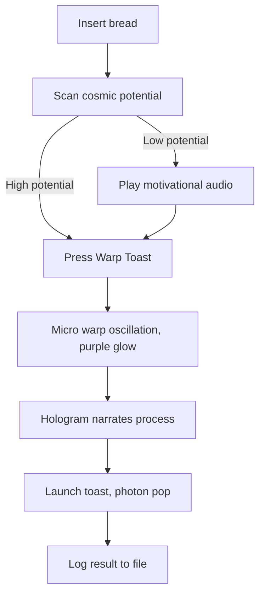

# Cosmic Toaster

### Inputs
Theme: Pirates  
Input answers full file path location: answers.md  
Target folder full folder path location: backlog/  
Output file full file path location: audit.md  

### Timing, cost, and tokens
Total running time: [paste /cost output]  
Cost in GBP: [paste /cost output]  
Number of tokens used: [paste /cost output]  

### Subagent statuses
✅ Process-1 audit completed.  
✅ Review-1 coherence completed.  
✅ Review-2 sources completed.  
✅ Review-3 missing information completed.  

## Process-1

### Feature list

#### Cosmic Toaster
The user inserts bread into the Quantum Slot, then the toaster scans it for cosmic potential. If potential is low, motivational audio plays to encourage the bread. Pressing Warp Toast starts a micro warp oscillation, with visible shaking and a purple glow. A hologram narrates the process, then the toast launches upward with a photon powered pop. The device logs the result to warp toast log text file. **🟢Verified information**
Source: `feature-cosmic-toaster.md:8-22`  

Pirate retelling. The sailor loads a biscuit into the Powder Keg, and the ship parrot squawks encouragement if the biscuit looks unseaworthy. Hauling the Cannon Rope fires the biscuit skyward in a burst of purple smoke, while a ghostly captain narrates the voyage before the toast lands on deck with a cannon boom. The quartermaster logs the raid in the ship log.  

### Gaps in testing
Only end to end testing exists for the Cosmic Toaster. There is no unit testing for individual components such as the cosmic potential scanner or the hologram narrator, and no integration testing for combined behaviours such as warp oscillation running alongside hologram narration. The existing end to end tests only confirm that toast appears, and do not check narration accuracy or timing. As a result the end to end suite does not detect the mispronunciation bug. No logs exist for motivational audio timing, so that bug cannot be diagnosed from logs alone. The launch height bug is only observed when cabinets are present in the test environment, so results are inconsistent across setups. **🟢Verified information**
Source: `feature-cosmic-toaster.md:34-44`  

### Known bugs
1. Toast occasionally launches too high, hitting the underside of kitchen cabinets, and this is only caught in environments with cabinets present. **🟢Verified information** **🐞Bug present**  
2. The purple glow sometimes persists for several minutes after toasting, which alarms nearby pets. **🟢Verified information** **🐞Bug present**  
3. Motivational audio sometimes plays after the toast has already finished, confusing users, and no timing logs exist to help diagnose it. **🟢Verified information** **🐞Bug present**  
4. The hologram star occasionally mispronounces photon as potato, a cosmetic bug that current end to end tests cannot detect. **🟢Verified information** **🐞Bug present**
Source: `feature-cosmic-toaster.md:25-31,39-44`  

### Test automation estimate
Estimated effort to close the testing gaps: 2 working days for Devin AI to script end to end and integration checks, and 3 working days for 1 automation tester to design and validate unit tests for the scanner and hologram components. **🟥Fabricated information**  